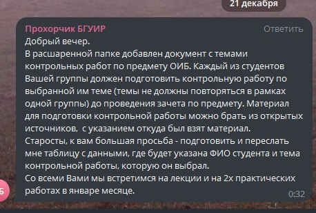

# Основы информационной безопасности (ОИнфБ)

СЭО предмета: [https://lms.bsuir.by/course/view.php?id=5066](https://lms.bsuir.by/course/view.php?id=5066)

## До сессии



10 страниц 21 вариант

## Контакты преподавателей

### Прохорчик Руслан Владимирович

* Телефон: 293-88-20
* Email: [Prohorchik@bsuir.by](mailto:Prohorchik@bsuir.by)
* Кабинет: 212-4 (ул. Гикало 9)
* Ссылка: [https://www.bsuir.by/ru/kaf-poit/prokhorchik-r-v](https://www.bsuir.by/ru/kaf-poit/prokhorchik-r-v)
