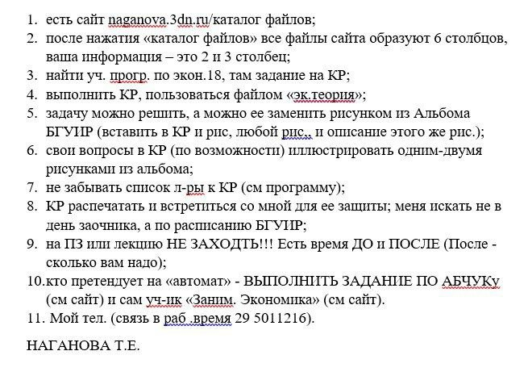

# Метрология стандартизация и сертификация (в информационных технологиях) (МСиСвИТ)

СЭО предмета: [https://lms.bsuir.by/course/view.php?id=5054](https://lms.bsuir.by/course/view.php?id=5054)

## До сессии

Туду: Учить теорию и готовиться к зачету

Язык: Русский

Куда сдавать свои рукописи: Устно на сессии

Ленимся: До сессии, ну или если кто хочет, можно начать готвоиться раньше

Варик: -

Условие зачета: Ответить минимум на 4

## Контакты преподавателей

## ???
